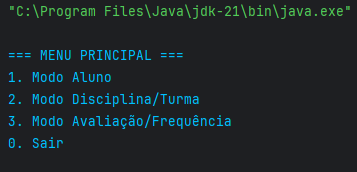
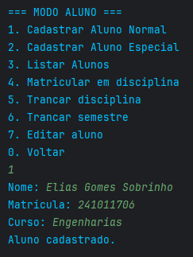
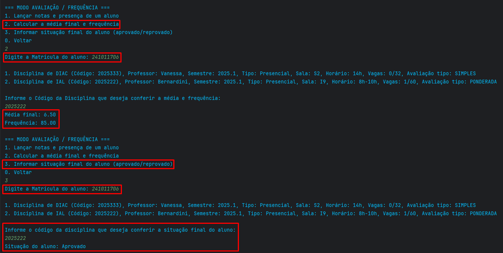

## Dados do Aluno

- **Nome completo:** [Elias Gomes Sobrinho]
- **Matrícula:** [241011706]
- **Curso:** [Engenharias]
- **Turma:** [06]

---

## Instruções para Compilação e Execução

1. **Compilação:**  
   Clone este repositório: https://github.com/HouNst7/ep1-OO-2025_1--Elias-Gomes-Sobrinho-241011706
   
   javac Main.java
   [Descrever aqui como compilar o projeto. Exemplo: `javac Main.java` ou o script usado]

2. **Execução:**  
   Abra a pasta do projeto em uma IDE como IntelliJ ou o VSCode, execute o arquivo Main.java localizado dentro da pasta src na IDE de sua preferência.
   Diretório para chegar na Main: ep1-OO-2025_1--Elias-Gomes-Sobrinho-241011706/Trabalho1-OO-EliasSobrinho241011706/src/Main.java
   

4. **Estrutura de Pastas:**  

ep1-OO-2025_1--Elias-Gomes-Sobrinho-241011706/  
├── .idea/ # Configurações do IntelliJ IDEA  
├── out/ # Arquivos compilados  
├── Trabalho1-OO-EliasSobrinho241011706/  
│ ├── src/  
│ │ ├── Main.java  
│ │ ├── Aluno/  
│ │ │ ├── Aluno.java  
│ │ │ ├── AlunoEspecial.java  
│ │ │ └── GerenciadorAlunos.java  
│ │ ├── Avaliacao_Frequencia/  
│ │ │ ├── Avaliacao.java  
│ │ │ ├── Frequencia.java  
│ │ │ ├── GerenciadorPerformanceAluno.java  
│ │ │ └── AvaliacaoTipo.java (enum)  
│ │ ├── Disciplina_Turma/  
│ │ │ ├── Disciplina.java  
│ │ │ ├── GerenciadorDisciplinas.java  
│ │ │ ├── GerenciadorTurmas.java  
│ │ │ └── Turma  
│ │ ├── UtilidadesEAfins/  
├── alunos.txt # Arquivo de dados dos alunos  
├── avaliacoes.txt # Arquivo de dados de avaliações  
├── disciplinas.txt # Arquivo de dados das disciplinas  
├── matriculas.txt # Arquivo de dados de matrículas  
├── turmas.txt # Arquivo de dados das turmas  
└── README.md # Este arquivo  

5. **Versão do JAVA utilizada:**  
   [Java 21]

---

## Vídeo de Demonstração

- [Inserir o link para o vídeo no YouTube/Drive aqui]

---

## Prints da Execução

1. Menu Principal:  
   

2. Cadastro de Aluno:  
   

3. Relatório de Frequência/Notas:  
   

---

## Principais Funcionalidades Implementadas

- [X] Cadastro, listagem, matrícula e trancamento de alunos (Normais e Especiais)
- [X] Cadastro de disciplinas e criação de turmas (presenciais e remotas)
- [X] Matrícula de alunos em turmas, respeitando vagas e pré-requisitos
- [incompleto] Lançamento de notas e controle de presença
- [X] Cálculo de média final e verificação de aprovação/reprovação
- [não realizado] Relatórios de desempenho acadêmico por aluno, turma e disciplina
- [X] Persistência de dados em arquivos (.txt ou .csv)
- [X] Tratamento de duplicidade de matrículas
- [X] Uso de herança, polimorfismo e encapsulamento

---

## Observações (Extras ou Dificuldades)

- [No começo eu tive muita dificuldade pois não sabia nada em Java e achava muito difícil essa questão de Classes e instâncias de uma classe, não entendia muito o por que de uso de this, criar uma instância com o mesmo nome da classe, Override... enfim, essas "peculiaridades" de uma linguagem orientada a objetos, sei que eu fiz APC em C mas foi muito curtinho, nada muito "extenso", pois foi só 1 mês em C já que primeiramente a minha turma estudou Calango (que pesadelo), e minhas outras experiências com programação era mais em "Design", afinal fiz DS e cuidei do design do site (css e html) desenvolvido pelo meu grupo, além de ajudar na criação de algumas páginas usando JavaScript. Ademais, minha opinião sobre a linguagem antes de conhecê-la era de "medo", parecia ser algo muito abstrato e não muito intuitivo, e após a realização deste trabalho acho que continuo pensando o mesmo, entre as linguagens de programação que "me aprofundei" Java é a mais complicada entre todas e a que eu menos gostei, fico até imaginando como que é o código de Minecraft, deve ser algo absurdo. As maiores dificuldades foram no Modo Avaliação/Frequência, tanto é que está incompleto, além disso funções como a de salvar os dados e map (que eu já achava complicado em JavaScript) achei extremamente complicado, mas talvez essa seja apenas a opinião de um iniciante, de todo modo acho bem mais tranquilo isso em outras linguagens. No mais é isso, não tenho muito a declarar além de dificuldades mesmo.]

---

## Contato

- [241011706@aluno.unb.br]
